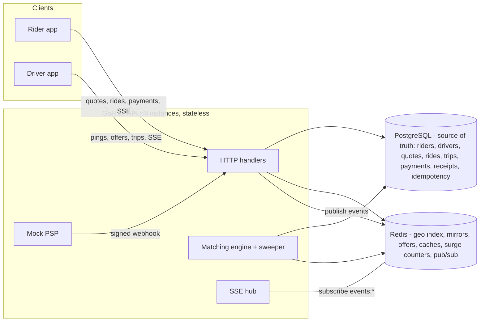

# GoRide — High-Level Design

Companion to [SPEC.md](SPEC.md) (the LLD: exact contracts, schemas, key layouts, state machines). This document covers the architecture, why it is shaped this way, how each hot path meets its scale target, and the evolution path for the concerns deliberately not built.

## 1. System shape

One stateless Go service (modular monolith), PostgreSQL for transactional truth, Redis for the geo index / caches / real-time fan-out, and a React SPA client.

**Why a monolith.** The assignment allows synchronous APIs; the graded qualities (correct state transitions, consistency under concurrency, latency, monitoring) are orthogonal to service count. Package boundaries (`rides`, `matching`, `drivers`, `trips`, `payments`, `pricing`, `quotes`, `events`) mirror what would become services if the team/scale demanded it — the seams (interfaces like `EventPublisher`, structural interfaces between packages) are the future RPC boundaries.

**Why stateless.** Every piece of shared state lives in Postgres or Redis:
- No in-process session or ride state; caches are Redis-backed.
- SSE fan-out goes through Redis pub/sub, so any instance serves any client's stream regardless of where the state change happened (verified cross-instance in the M5 test run).
- The matching sweeper coordinates through `FOR UPDATE SKIP LOCKED` — N instances can all run it with no leader election; each ride is processed by exactly one sweeper pass at a time.

## 2. Hot paths vs. the scale targets

Targets from the assignment: ~100k drivers, ~10k ride requests/min, ~200k location updates/sec, matching ≤1s p95.

### 2.1 Location ingestion (200k/sec)
The ping path is: auth → validate → **2 pipelined Redis round-trips, zero Postgres** (rate-limit + mirror read; then last-position SET, conditional GEOADD, trip-distance increment, throttled publish). Nothing on this path locks, queries, or blocks on the relational store; Postgres holds only the driver's *profile and coarse status*, not positions.

Arithmetic: one ping ≈ 6 Redis ops in 2 pipelines. 200k pings/sec ≈ 1.2M Redis ops/sec — beyond one node, exactly at the comfortable range of a small Redis Cluster. The keys are already **sharded by city** (`geo:drivers:{city}`), which is also the natural cluster-slot and multi-region partitioning dimension: a city's drivers, demand counters and offers are colocated and never referenced cross-city.

Back-pressure: per-driver token bucket (3/sec) rejects abusive clients at the cheapest point.

### 2.2 Matching (≤1s p95)
- Candidate search is one `GEOSEARCH` on the city shard (~ms) filtered by tier/freshness via Redis mirrors — no Postgres in the search loop.
- The offer is claimed with `SET NX EX` — atomic across all instances, so concurrent matchers cannot double-offer a driver.
- Accept is one short Postgres transaction of two guarded UPDATEs (ride `MATCHING→DRIVER_ASSIGNED`, driver `available→on_trip`); the row locks are held for microseconds. Under contention the loser's UPDATE matches zero rows → clean 409.
- The measured demo-scale p95 for request→offer is well under the 1s target (see performance report); the design keeps that true at scale because every step is O(1)-ish against city-local data.

### 2.3 Reads
`GET /v1/rides/{id}` is a Redis read-through cache invalidated on every state transition (all transitions funnel through one code path, so invalidation cannot be forgotten piecemeal). Live tracking uses SSE push, so clients do not poll.

## 3. Consistency model

Postgres is the source of truth; Redis is a rebuildable projection (mirrors, geo, offers, caches). The system self-heals from a Redis flush: drivers re-appear on their next availability toggle/ping; offers simply re-issue.

Invariants and their enforcement (assignment §5):
| Invariant | Mechanism |
|---|---|
| ≤1 active ride per rider / per driver | **Partial unique indexes** — enforced by the DB even against buggy app code |
| No double assignment | Offer claim (`SET NX`) + single-tx guarded UPDATEs on accept |
| No lost/duplicated POSTs | `Idempotency-Key` table with conflict-safe insert + stored-response replay |
| Webhook replay safety | Guarded `PROCESSING→terminal` UPDATE keyed on unique `psp_ref`; receipt written in the same tx |
| Cache freshness | Write-through invalidation inside the single status-transition funnel |
| Fare correctness | Fare computed from the **quoted** surge/rates captured at booking; live surge never re-read |

## 4. Deliberately deferred (and the evolution path)

| Concern | Today | Evolution |
|---|---|---|
| Multi-region | Single region assumed | Rides are city-local: shard whole cities to home regions (region-local writes — a Bengaluru ride never crosses an ocean). Cross-region needs only async replication for analytics/user profiles. The `city` field on drivers/quotes is the routing key already. |
| Multi-tenancy | Single tenant | `tenant_id` column on riders/drivers/rides + composite indexes; per-tenant rate limits and Redis key prefixes (`geo:{tenant}:{city}`). No architectural change — the monolith is already partitioned by city keys. |
| Redis beyond one node | Single node | Redis Cluster; city-prefixed keys hash to slots naturally. SSE moves from per-connection SUBSCRIBE to one shared PSUBSCRIBE per instance with in-process fan-out (documented in `events.Hub`). |
| Message queues | In-process hooks + sweeper | If offer orchestration outgrows the sweeper (multi-step timeouts, driver-app push retries), the `MatchRequested` seam becomes a queue producer. Nothing else assumes synchrony. |
| Real PSP | Mock with signed async webhooks | The webhook contract (HMAC, idempotent on `psp_ref`, retryable trigger) is exactly the real-PSP shape; swap the in-process poster for the provider SDK. |
| Push notifications | SSE only | The `EventPublisher` seam is the single emission point; an APNs/FCM publisher composes alongside the SSE one. |

## 5. Security posture (assignment scope)

Bearer tokens with role separation (rider/driver) and path-actor guards; strict input validation everywhere; HMAC-verified webhooks (constant-time compare); per-driver rate limiting; secrets via env only; parameterized SQL exclusively (pgx); no PII in logs. Out of scope by design: token issuance/rotation (tokens are seeded), TLS termination (deployment concern), full rate-limit coverage on every endpoint.

## 6. Observability

New Relic Go APM on all handlers with DB/Redis segment timing; custom domain metrics (match latency, offer acceptance, active rides); alert policy on hot-endpoint p95. k6 scenarios in `loadtest/` reproduce the assignment's traffic shape; the before/after numbers live in [performance-report.md](performance-report.md).
