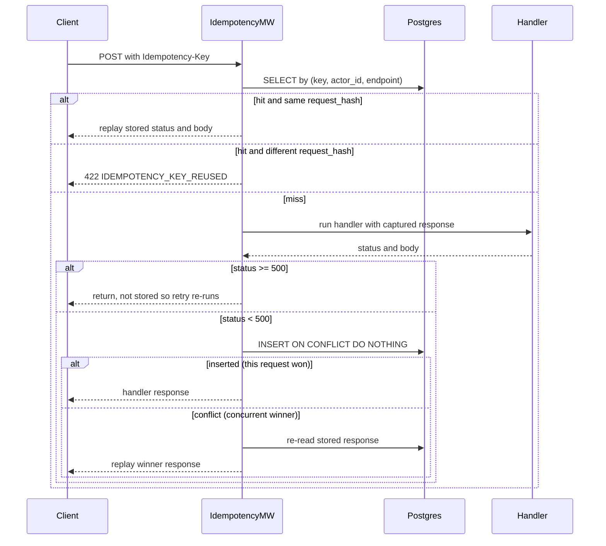
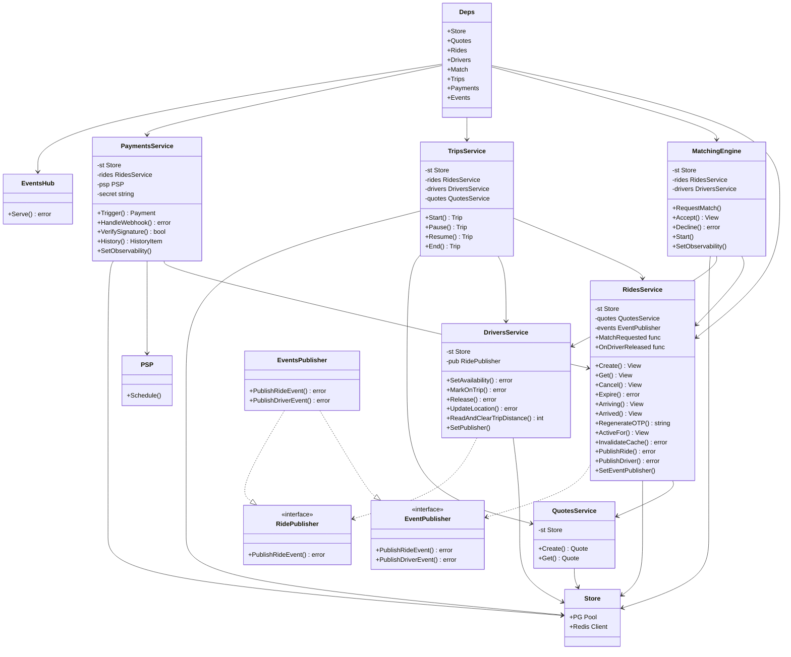
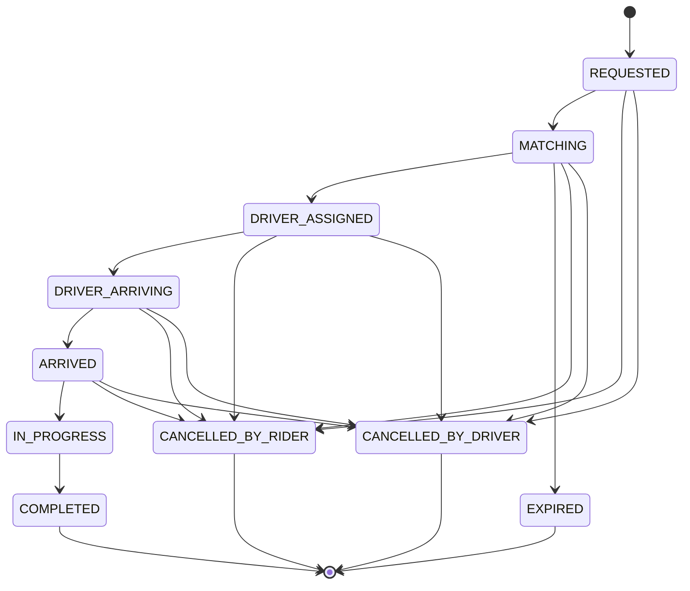
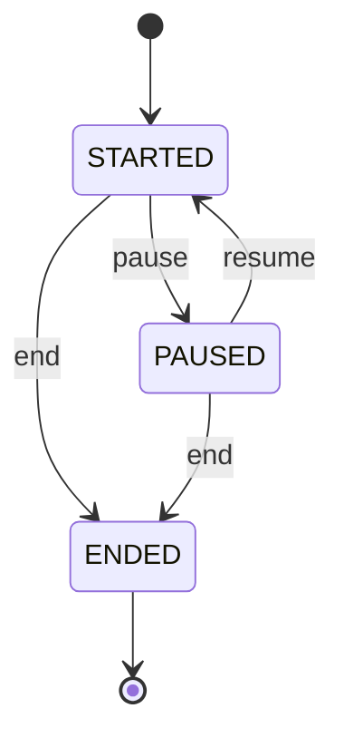
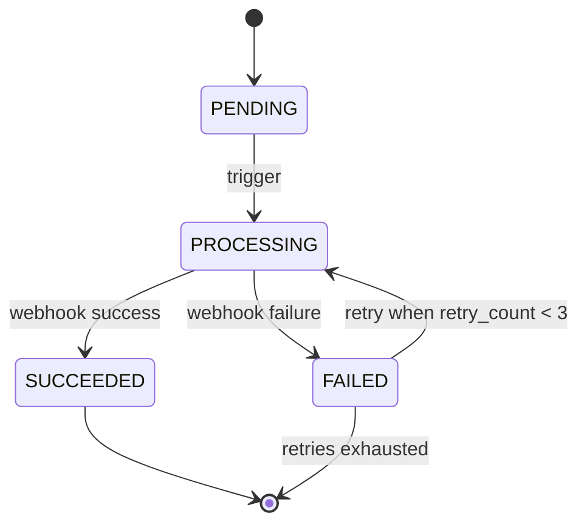
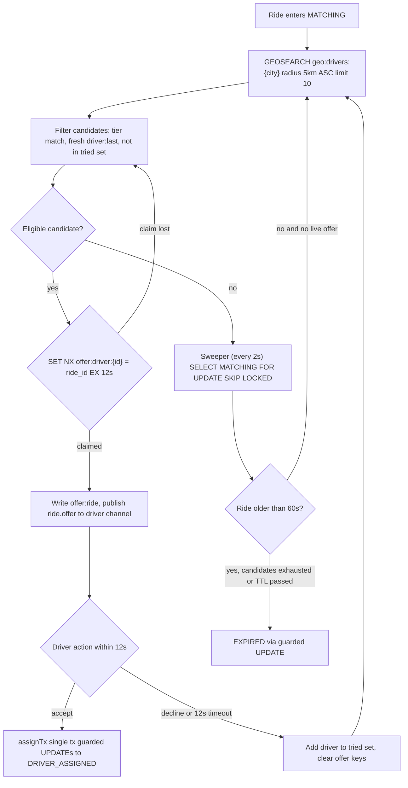
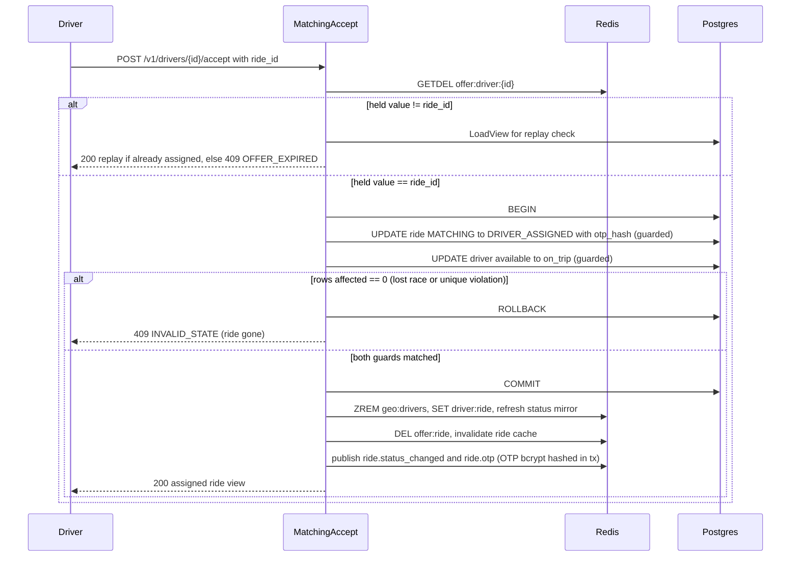
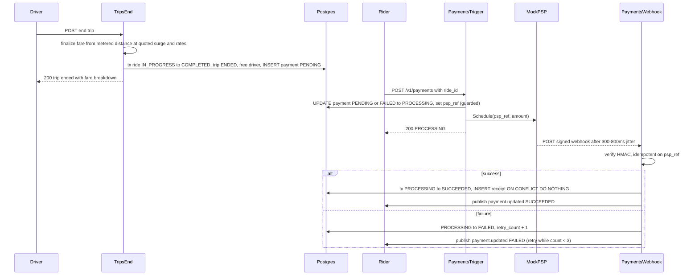
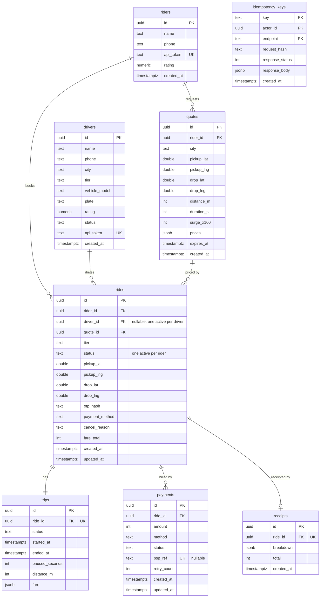

# GoRide — Internal Engineering Spec (LLD contracts)

Binding contracts for all backend work. If code and this spec disagree, fix the code or propose a spec change — don't silently drift.

## Conventions

- Go 1.26, module `github.com/lokeshbm/goride`. Router: `chi/v5`. Postgres: `pgx/v5` (pool). Redis: `go-redis/v9`. Migrations: `golang-migrate` SQL files in `migrations/`.
- IDs: UUIDv4 strings, generated in app code (`google/uuid`).
- Money: integer paise (INR), never floats. Distances: meters (int). Durations: seconds (int).
- Timestamps: `timestamptz`, UTC everywhere.
- Errors over HTTP: `{"error": {"code": "SNAKE_CASE_CODE", "message": "human readable"}}` with correct status. Codes are stable API surface.
- Config via env only (`GORIDE_` prefix): `GORIDE_ADDR`, `GORIDE_PG_DSN`, `GORIDE_REDIS_ADDR`, `GORIDE_ENV`, `GORIDE_NEWRELIC_LICENSE` (optional; agent disabled when empty), `GORIDE_NEWRELIC_APP_NAME` (optional; defaults to `goride`).
- Every request gets a request ID (middleware), logged with `log/slog` (JSON in prod, text in dev).
- Single city for demo: `BLR`. City is a field on drivers/quotes/rides — never hardcode beyond defaults.

## Auth (basic API security)

- `Authorization: Bearer <token>`; tokens are per-actor rows (`riders.api_token`, `drivers.api_token`), seeded for demo.
- Middleware resolves actor + role (`rider` | `driver`); handlers declare required role. Actor mismatch (e.g. driver A calling accept for driver B) → 403 `FORBIDDEN`.
- Mock PSP webhook: HMAC-SHA256 signature over body with shared secret `GORIDE_PSP_SECRET`, header `X-PSP-Signature`.

## Idempotency

- All mutating POSTs (except location pings and availability) require `Idempotency-Key` header.
- Table `idempotency_keys(key, actor_id, endpoint, request_hash, response_status, response_body, created_at)`; PK `(key, actor_id, endpoint)`.
- Same key + same request hash → replay stored response. Same key + different hash → 422 `IDEMPOTENCY_KEY_REUSED`.
- Implemented as middleware wrapping handlers; stored in the same DB as the domain write where transactionally possible.

### Idempotency middleware flow

How `httpapi.idempotency` scopes, replays, and stores a mutating POST. 5xx responses are deliberately not stored so a retry re-runs the handler.



## Service architecture

Domain services and their dependency wiring. Constructors take explicit deps: `rides.NewService(store, quotes, log)`, `matching.NewEngine(store, rides, drivers, log)`, `trips.NewService(store, rides, drivers, quotes, log)`, `payments.NewService(store, rides, psp, secret, log)`. `events.Publisher` implements both the `rides.EventPublisher` and `drivers.RidePublisher` interfaces and is wired in via `SetEventPublisher`/`SetPublisher`. The `rides.Service.MatchRequested` seam is wired to `matching.Engine.RequestMatch`, and `rides.Service.OnDriverReleased` to `drivers.Service.Release`. `httpapi.Deps` holds pointers to every service.



## State machines

```
Ride:    REQUESTED → MATCHING → DRIVER_ASSIGNED → DRIVER_ARRIVING → ARRIVED
         → IN_PROGRESS → COMPLETED
         Terminal alternates: CANCELLED_BY_RIDER, CANCELLED_BY_DRIVER (both only before IN_PROGRESS),
         EXPIRED (from MATCHING when candidates exhausted / TTL passed)
Trip:    STARTED → (PAUSED ⇄ STARTED)* → ENDED
Payment: PENDING → PROCESSING → SUCCEEDED | FAILED (FAILED → PROCESSING on retry, max 3)
```

- Transitions live in one function per entity: `rides.Transition(from, to) error` etc. Handlers never write status strings directly.
- Every ride transition: (1) Postgres update with optimistic guard (`WHERE status = $from`), (2) invalidate `ride:cache:{id}`, (3) publish SSE event. Rows affected = 0 → 409 `INVALID_STATE`.

### Ride state machine

The authoritative edges from `internal/rides/state.go`. Cancellation is legal only pre-IN_PROGRESS; EXPIRED only from MATCHING; COMPLETED / CANCELLED_* / EXPIRED are terminal.



### Trip state machine

Trip lifecycle from `internal/trips` (STARTED and PAUSED both end via the `status IN (STARTED, PAUSED)` guard).



### Payment state machine

Payment lifecycle from `internal/payments`. FAILED is retryable back to PROCESSING while retry_count < maxRetries (3); once exhausted it stays terminal.



## Redis key contract

| Key | Type | TTL | Purpose |
|---|---|---|---|
| `geo:drivers:{city}` | GEO | — | Available drivers' positions. Member = driver_id. Removed on offline/assignment. |
| `driver:last:{driver_id}` | STRING (JSON lat,lng,ts) | 30s | Freshness check; stale ⇒ skip in matching |
| `offer:driver:{driver_id}` | STRING = ride_id, `SET NX` | 12s | Atomic offer claim — one offer per driver |
| `offer:ride:{ride_id}` | STRING (JSON driver_id, attempt, expires_at) | 12s | Current outstanding offer for sweeper/decline |
| `ride:cache:{ride_id}` | STRING (JSON) | 60s | Read-through cache for GET ride |
| `surge:req:{city}:{cell}:{minute}` | INT counter | 5m | Demand, geohash-5 cell, minute buckets |
| `ratelimit:loc:{driver_id}` | token bucket | — | Max 3 pings/sec |
| pub/sub `events:ride:{ride_id}` | channel | — | Ride lifecycle events |
| pub/sub `events:driver:{driver_id}` | channel | — | Offers + assignments to driver |

Supply for surge = `ZCARD`-equivalent count of available drivers in the cell area (GEOSEARCH count). Surge = bucket(demand/supply): <1 → 1.0, <2 → 1.2, <3 → 1.5, else 2.0. No drivers → 2.0.

## Pricing

- Tiers: `mini`, `sedan`, `xl`. Per-tier: base fare, per-km rate, per-min rate (constants table in `pricing`, INR paise).
- Estimate: haversine distance × 1.3 road factor; duration = distance / 22 km/h city speed.
- Quote: per-tier price = (base + km·per_km + min·per_min) × surge, rounded to rupee. Quote row stores all tier prices + surge; `expires_at = now()+3m`. Booking with expired quote → 422 `QUOTE_EXPIRED`.
- Final fare on trip end: actual distance (sum of driver ping path, fallback quote distance) and actual duration minus paused time, at the **quoted** surge and rates. Never re-read live surge at trip end.

## Matching

1. On ride create: status MATCHING; `GEOSEARCH geo:drivers:{city}` around pickup, radius 5km, ASC, limit 10; filter stale (`driver:last`) and tier mismatch.
2. Offer loop (per ride, driven by matcher goroutine + sweeper): claim best candidate `SET offer:driver:{d} ride_id NX EX 12`; on success write `offer:ride`, publish offer event to driver channel.
3. Accept (`POST /v1/drivers/{id}/accept` with ride_id): verify `offer:driver:{id}` == ride_id (GETDEL), then one tx: lock ride+driver rows `FOR UPDATE`, assert ride MATCHING & driver available, set ride DRIVER_ASSIGNED + driver_id, driver status on_trip; `ZREM` from geo set. Generate 4-digit OTP, store bcrypt hash on ride, deliver OTP via rider SSE event.
4. Decline/timeout: delete offer keys, mark candidate tried (in `offer:ride` attempt state → keep tried set in Redis `offered:ride:{id}` SET, TTL 10m), offer next. Candidates exhausted or ride older than 60s in MATCHING → EXPIRED (restore nothing; driver never held).
5. Sweeper: every 2s, `SELECT ... FROM rides WHERE status='MATCHING' FOR UPDATE SKIP LOCKED` (+ no live offer key) → advance offer loop or expire. Safe on N instances.

### Matching engine flowchart

One pass of the offer loop plus the sweeper that advances or expires MATCHING rides.



### Accept transaction sequence

Assignment consumes the offer with an atomic GETDEL, then commits both guarded UPDATEs in one Postgres transaction. Concurrent accepts lose the race and get a 409.



## Trips

- `start`: driver-only, requires OTP match (bcrypt compare) + ride ARRIVED → IN_PROGRESS, create trip row STARTED. Wrong OTP → 422 `INVALID_OTP` (no state change).
- `pause`/`resume`: driver-only, toggles trip PAUSED/STARTED, accumulates `paused_seconds`.
- `end`: driver-only, ride IN_PROGRESS → COMPLETED, trip ENDED, compute fare (see Pricing), write fare breakdown to trip, create payment PENDING, driver back to available + `GEOADD` last position.

## Payments (mock PSP)

- `POST /v1/payments {ride_id}` (rider): payment PENDING → PROCESSING, "call" mock PSP inline (in-process module) which schedules a webhook POST to ourselves after 300–800ms with 90% success.
- Webhook: verify HMAC, idempotent on `psp_ref` (unique), PROCESSING → SUCCEEDED/FAILED. On SUCCEEDED create receipt (immutable breakdown JSON). FAILED → retryable via same payments endpoint (retry_count max 3).

### Trip-end to receipt sequence

From the driver ending the trip to a paid receipt. Fare is finalized from metered distance at the quoted surge; the mock PSP confirms asynchronously with a signed webhook.



## Schema (tables — full DDL in migrations)

- `riders(id, name, phone, api_token unique, created_at)`
- `drivers(id, name, phone, city, tier, vehicle_model, plate, rating, status offline|available|on_trip, api_token unique, created_at)`
- `quotes(id, rider_id fk, city, pickup_lat/lng, drop_lat/lng, distance_m, duration_s, surge_x100 int, prices jsonb, expires_at, created_at)`
- `rides(id, rider_id fk, driver_id fk null, quote_id fk, tier, status, pickup/drop lat/lng, otp_hash, payment_method, cancel_reason null, fare_total null, created_at, updated_at)`
  - `UNIQUE (rider_id) WHERE status IN (active set)` — partial; same for `driver_id`
  - `INDEX (status, created_at)` for sweeper; `INDEX (rider_id, created_at DESC)` for history
- `trips(id, ride_id fk unique, status, started_at, ended_at, paused_seconds, distance_m, fare jsonb)`
- `payments(id, ride_id fk, amount, method, status, psp_ref unique null, retry_count, created_at, updated_at)` + `INDEX (ride_id)`
- `receipts(id, ride_id fk unique, breakdown jsonb, total, created_at)`
- `idempotency_keys(key, actor_id, endpoint, request_hash, response_status, response_body, created_at)` PK (key, actor_id, endpoint)
- `schema_seed`: demo riders/drivers with fixed api_tokens (documented in README when built).

### Entity-relationship diagram

Tables, key columns, and foreign keys from `migrations/*.up.sql`. Note the two partial unique indexes on `rides` (`rides_active_rider_uq` on rider_id and `rides_active_driver_uq` on driver_id, each restricted to the active status set) that enforce one active ride per rider and per driver, the unique `psp_ref` on payments, and the unique `ride_id` on trips and receipts (one trip and one receipt per ride). `idempotency_keys` has the composite PK (key, actor_id, endpoint) and no FK on actor_id.



## SSE events

`GET /v1/events?ride_id=…` (rider or driver on that ride) and `GET /v1/events/driver/{id}` (driver: offers). Event envelope:
`{"type": "ride.status_changed|ride.offer|ride.driver_location|payment.updated", "ride_id": "...", "data": {...}, "ts": "..."}`
Hub subscribes to Redis pub/sub; handlers publish via `events.Publish(ctx, channel, event)`. During an active ride, driver location pings are republished (throttled to 1/s) onto the ride channel for rider tracking.

## Constants & logging conventions

- Every `internal/` package keeps a `constants.go` grouping, in labeled blocks: domain constants (statuses, limits, TTLs), Redis key prefixes/builders, and that package's log message constants (`logMsg*` unexported, e.g. `logMsgSweeperStopped = "matching: sweeper stopped"`). No magic strings/numbers inline in logic files.
- Log calls use the message constants: `s.log.Warn(logMsgCacheInvalidateFailed, "error", err, ...)`. Structured attrs stay inline at the call site.
- API error codes live ONLY in `internal/httpapi/codes.go` (exported consts, one authoritative list — they are stable API surface). Handlers never write code strings inline.
- Constants stay in the package that owns them — no shared "constants" package. Cross-package needs indicate the constant belongs to the owning domain's exported surface.

## Testing conventions

- Unit tests colocated `_test.go`; table-driven. Fakes for store interfaces — no DB required for unit tests.
- Integration/concurrency tests (build tag `integration`) hit real Postgres+Redis from env DSNs.
- `make test` = unit; `make test-integration` = tagged.
